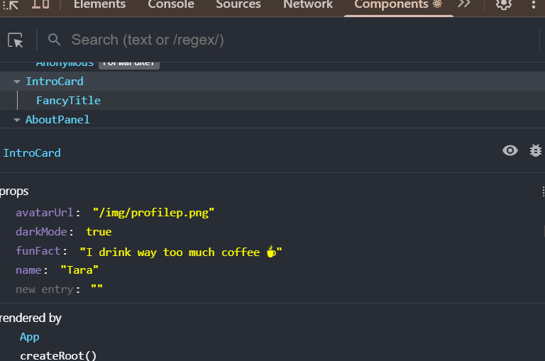

My introduction app #2:
This is my React + Typescript application project built with Vite. The application displays information about me like my name, random funfacts (that i reveal in dark mode) loaded from a local JSON file that displays every two seconds,and a bit more. i added some animation to make the app a bit more fun and not so static.

What you need to run the application:

- A code editor like VS code
- Node.js
- Npm


Tools used: 
React + Typescript with Vite
VS code with prettier (for code formatting)
React Devtools

Data source:
The funfacts are stored in public/funfacts.json

Step by step:

1. Clone my repository, run this in your terminal:
git clone https://github.com/taraamin/interactive_frontend_work_req_1.git
cd interactive_frontend_work_req_1

2. install the dependencies :

```bash
npm install
```

3. Run the app:
 Clone the repository:
   ```bash
   git clone https://github.com/taraamin/interactive_frontend_work_req_2.git
   cd interactive_frontend_work_req_2

4. Run server and open the link:
 npm run dev in the terminal
http://localhost:5173/


Application features:
- Toggle light/dark mode
- Random fun facts revealed in dark mode. New fact displays every 2 seconds.
- Profile avatar with pop in animation and hover tilt
- Introduction text with hover wave effect
- Bullet stackering effect for "About me"
- "Find me" with dissapearing hover effect so that you can`t actually find me.


Devtool Screenshot:


